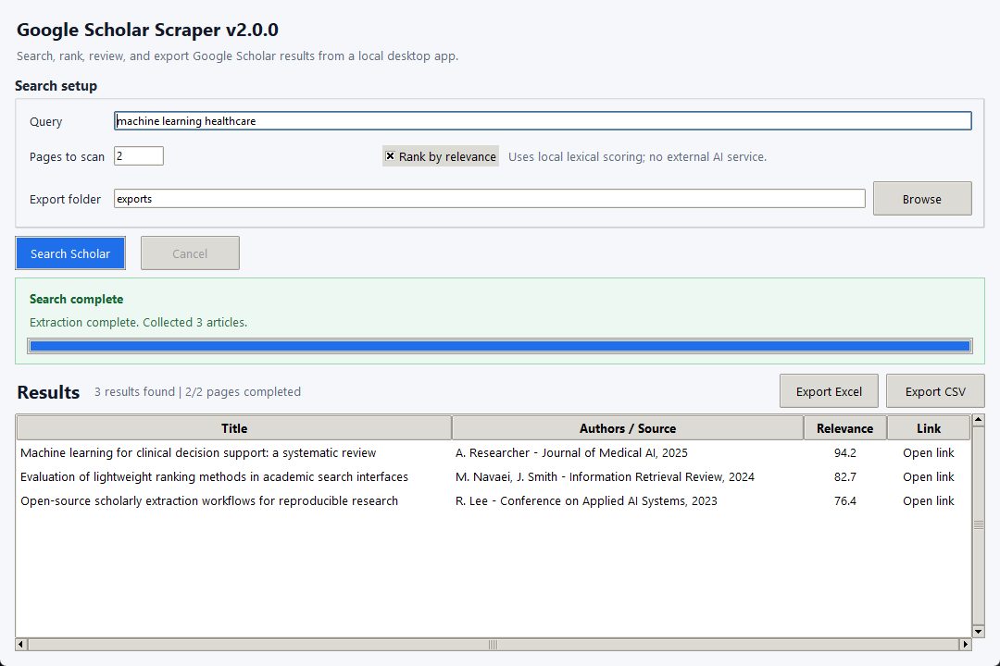

# Google Scholar Scraper V2.0.0

A Windows desktop app for extracting, ranking, reviewing, and exporting Google
Scholar search results.

Google Scholar Scraper V2 is a local research utility for collecting Scholar
result pages, removing duplicates, applying optional lexical relevance ranking,
and exporting reviewed results to Excel or CSV. It is source-available for
noncommercial use under the PolyForm Noncommercial License 1.0.0, with separate
commercial licensing available.


[](https://github.com/MahdiNavaei/Google-Scholar-Scraper/actions/workflows/ci.yml)
[](https://github.com/MahdiNavaei/Google-Scholar-Scraper/actions/workflows/build-windows.yml)




Google Scholar Scraper is not affiliated with Google. It does not solve CAPTCHA,
bypass access controls, rotate proxies, use account credentials, or use stealth
browser automation.

## Why V2?

The original goal is simple: make small-scale academic result collection easier
without turning the project into an unsafe crawler or a heavyweight data
platform. V2 focuses on a dependable desktop workflow, explicit failure states,
local-only ranking, deterministic exports, and Windows packaging.

What matters in practice:

- No API key is required.
- No LLM or external AI service is used.
- Smart Relevance Ranking runs locally.
- Rate limits, blocked pages, parser errors, and cancellations are explicit.
- Partial results are preserved when extraction stops early.
- Reviewed results export to Excel and CSV.
- Windows distribution supports both portable and installer-based workflows.

## Core Features

- Search Google Scholar by query and page count.
- Review collected articles in a responsive Tkinter/ttk desktop table.
- Open result links directly from the table.
- Enable or disable local relevance ranking.
- Preserve usable partial results when later pages fail or the user cancels.
- Export reviewed results to Excel or CSV.
- Run from source, portable Windows ZIP, or Windows installer artifacts.

## Smart Relevance Ranking

Smart Relevance Ranking is optional and runs locally. It compares the query
with article title and author/source metadata using deterministic token
weighting and TF-IDF-style cosine scoring.

The score is shown as `Relevance` in the UI and `Relevance Score` in exports.
It is a review aid, not a semantic understanding score, confidence value,
citation-quality metric, or scientific assessment of a paper.

Ranking does not use:

- LLMs.
- External AI APIs.
- Embedding services.
- Model downloads.
- GPU acceleration.

## Reliability Model

The scraper uses a reusable HTTP session, explicit timeouts, conservative
request headers, bounded retries, and request pacing. Google Scholar can still
rate-limit, block, challenge, or change markup without notice.

V2 reports these states instead of treating every response as a successful
empty result:

| Status | Meaning |
| --- | --- |
| `SUCCESS` | Requested pages completed and results were collected. |
| `PARTIAL_SUCCESS` | Some pages completed, then extraction stopped early. |
| `NO_RESULTS` | Google Scholar returned no results for the query. |
| `RATE_LIMITED` | Google Scholar temporarily limited the request. |
| `BLOCKED` | Google Scholar returned a block, consent, or challenge page. |
| `NETWORK_ERROR` | Timeout, connection issue, or bad HTTP response. |
| `PARSING_ERROR` | The response could not be parsed safely. |
| `CANCELLED` | The user cancelled extraction. |

## Desktop Workflow

1. Enter a search query.
2. Choose the number of Google Scholar result pages to scan.
3. Choose an export folder.
4. Enable or disable `Rank by relevance`.
5. Click `Search Scholar`.
6. Review results in the table.
7. Open individual links as needed.
8. Export to Excel or CSV.

The UI remains responsive while extraction runs.

## Installation Options

Expected V2.0.0 release artifacts:

- `Google-Scholar-Scraper-v2.0.0-Portable-Windows-x64.zip`
- `Google-Scholar-Scraper-v2.0.0-Setup-Windows-x64.exe`
- `SHA256SUMS.txt`

Release artifacts are generated by the Windows build workflow and are intended
to be attached to the V2.0.0 GitHub Release. No public download URL is listed
here until the release exists.

### Portable Windows ZIP

1. Download the portable ZIP from the GitHub Release after it is published.
2. Verify the ZIP against `SHA256SUMS.txt`.
3. Extract the ZIP.
4. Run `GoogleScholarScraper.exe` from the extracted folder.

The portable build does not require a source checkout.

### Windows Installer

1. Download the installer from the GitHub Release after it is published.
2. Verify the installer against `SHA256SUMS.txt`.
3. Run the installer.
4. Launch it from the Start Menu or optional desktop shortcut.

The installer is built with Inno Setup and installs per user.

### Run From Source

Requirements:

- Python 3.9 or newer.
- Tkinter available in the Python installation.

```powershell
python -m pip install --upgrade pip
python -m pip install .
python -m google_scholar_scraper
```

## Export Formats

| Format | Default filename | Notes |
| --- | --- | --- |
| Excel | `scholar_articles.xlsx` | Written with `openpyxl`. |
| CSV | `scholar_articles.csv` | UTF-8 with BOM for Windows Excel. |

Exported columns:

- `Title`
- `Authors`
- `Link`
- `Relevance Score`

When ranking is disabled, `Relevance Score` is left blank instead of inventing
a score.

## Google Scholar Limitations

Google Scholar is an external service and may change behavior without notice.
Automated access can be rate-limited, blocked, challenged, or affected by markup
changes.

Use conservative page counts and respect applicable terms, policies, and laws.
This project does not guarantee uninterrupted access or complete coverage of
Google Scholar results.

## Privacy And Local Processing

- Ranking is performed locally.
- Exports are written to the selected local folder.
- No telemetry or analytics collection is implemented.
- No external AI service receives query or result data.
- Normal operation makes HTTP requests to Google Scholar for the query entered
  by the user.

## Development Setup

```powershell
python -m venv .venv
.\.venv\Scripts\Activate.ps1
python -m pip install --upgrade pip
python -m pip install -e .
```

Optional build dependency:

```powershell
python -m pip install pyinstaller
```

Run the deterministic test suite:

```powershell
python -m unittest discover -s tests
```

The tests use saved fixtures and mocked responses. They do not require live
Google Scholar access.

## Building Windows Artifacts

Local portable build:

```powershell
powershell -NoProfile -ExecutionPolicy Bypass -File scripts\build_windows.ps1
```

The script removes only known generated outputs (`build/` and `dist/`) before
building, then creates:

- PyInstaller `onedir` application under `dist/Google-Scholar-Scraper-v2.0.0/`
- Portable ZIP under `dist/release/`
- `SHA256SUMS.txt`

If Inno Setup is installed locally and `-SkipInstaller` is not used, the same
script also compiles the installer. The Windows GitHub Actions build workflow is
configured to install or locate Inno Setup and fail if the installer cannot be
built.

## Project Structure

```text
src/google_scholar_scraper/
  app.py                  CLI/application entrypoint
  models.py               Article and extraction result models
  dedupe.py               Normalization, validation, duplicate removal
  ranking.py              Local lexical relevance ranking
  exporters.py            CSV and Excel export
  scraper/client.py       Request flow, retries, progress, cancellation
  scraper/parser.py       Google Scholar HTML parsing and page classification
  ui/tkinter_app.py       Desktop UI

tests/
  fixtures/               Saved deterministic HTML fixtures
  test_*.py               Parser, client, ranking, export, UI, packaging tests

packaging/pyinstaller/    PyInstaller configuration
installer/                Inno Setup definition
scripts/                  Windows build helper
docs/                     Release and audit documentation
```

## Release And Documentation

- [Release notes](docs/RELEASE_NOTES_V2.0.0.md)
- [V2 release checklist](docs/V2_RELEASE_CHECKLIST.md)
- [Changelog](CHANGELOG.md)
- [PyInstaller spec](packaging/pyinstaller/GoogleScholarScraper.spec)
- [Inno Setup definition](installer/GoogleScholarScraper.iss)
- [Windows build script](scripts/build_windows.ps1)

## License

Google Scholar Scraper is source-available for noncommercial use under the
[PolyForm Noncommercial License 1.0.0](LICENSE).

This is not an OSI-approved open-source license. See [NOTICE](NOTICE) for
attribution and distribution notice information. See
[COMMERCIAL_LICENSE.md](COMMERCIAL_LICENSE.md) for the commercial licensing
summary.

## Commercial Licensing

The public repository is available under the PolyForm Noncommercial License
1.0.0. Commercial use requires a separate written commercial license from Mahdi
Navaei.

Commercial licensing inquiries are welcome. Pricing is not published publicly,
and each commercial arrangement may be evaluated separately.

For commercial licensing inquiries, contact
[Mahdi Navaei](https://github.com/MahdiNavaei).

## Sponsorship & Integrations

Project sponsorship, relevant commercial collaborations, carefully scoped
integrations, and ecosystem partnership discussions are welcome when they fit
the project direction.

For sponsorship or integration inquiries, contact
[Mahdi Navaei](https://github.com/MahdiNavaei).

Bug reports and focused issue reports are welcome. Larger code contribution
policy is intentionally conservative until a licensing and assignment process is
defined.

## Attribution

See [NOTICE](NOTICE) for attribution and distribution notice information.
